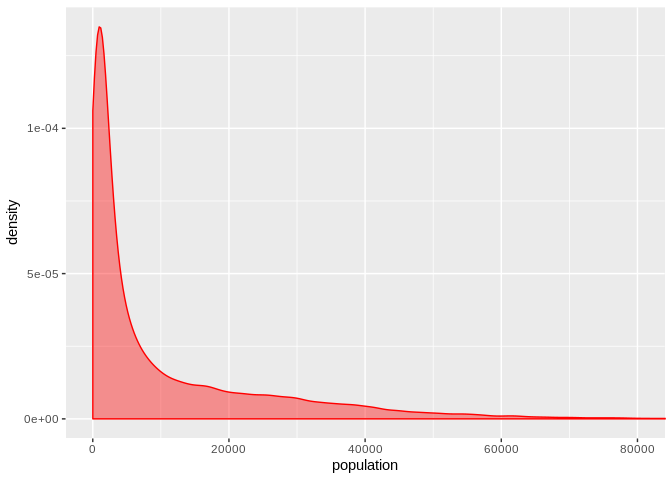
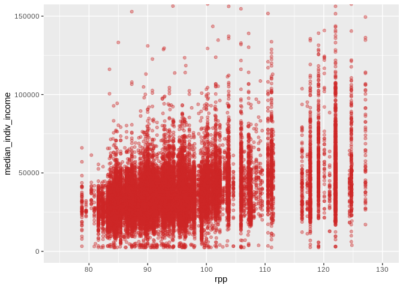
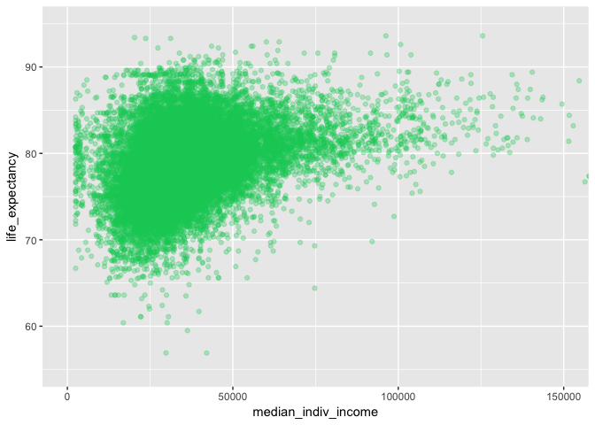
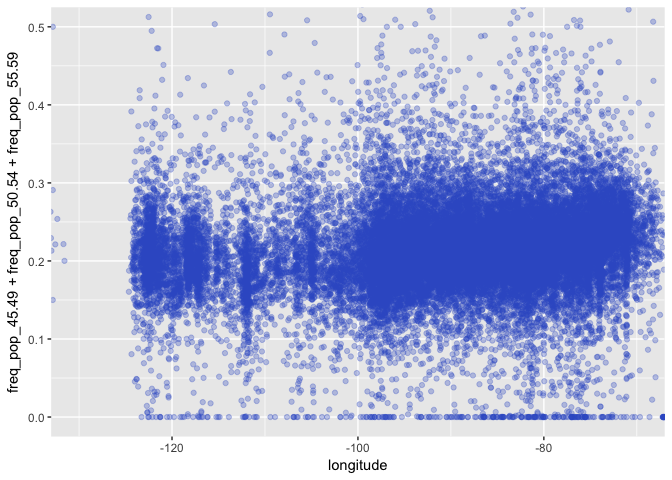
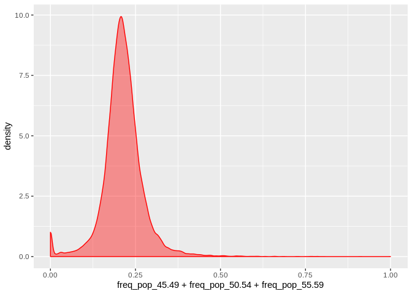
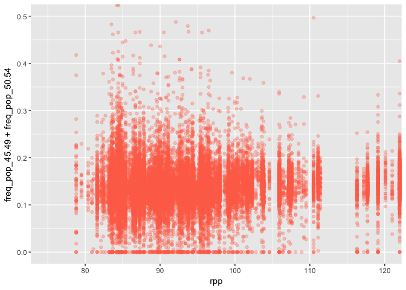
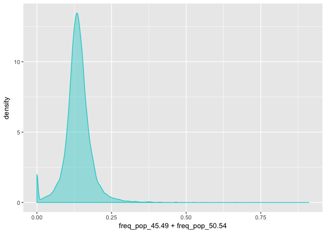
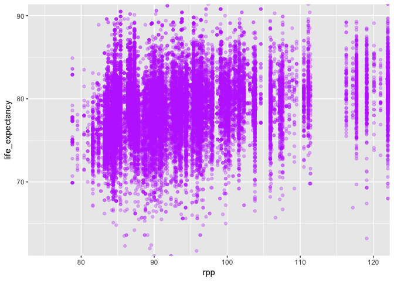

Exploratory Analysis
================

Now that we've aggregated potentially relevant data we want to do an exploratory analysis to look at our features. For this competition we are tasked with creating a scoring metric without any data to evaluate against. Thus, we only have guesses as to characteristics that constitute a high scoring ZIP code. It also means we are not able to incorporate any kind of supervised learning.

First, we want to look for correlations among variables. If two or more variables are highly correlated there may not be any use in trying to include all the correlated variables in a scoring model.

``` r
library(ggplot2)
# Read in
zip_data <- read.csv("./data/zip_data_final.csv")
# Subset data for zip codes with population greater than 0. These zip codes are not important for our scoring model
subset <- zip_data[which(zip_data$population > 0 & zip_data$median_indiv_income > 2000),]
```

Let's look at density for zip codes with population greater than 0.

``` r
ggplot(subset, aes(population)) + geom_density(color="red", fill="red", alpha=0.4) + theme(legend.position="none") + coord_cartesian(xlim=c(0,80000))
```



Not surpisingly, this is highly skewed. Zip codes are designed to aid in postal delivery logistics, not to meaningfully represent geographical areas for data science.

Our main concern is that some variables are highly correlated and thus including them individually in our simple scoring model is needlessly complex. This data may be more useful in its entirety with known response data, where features could be evaluated for importance.

``` r
ggplot(subset, aes(rpp, median_indiv_income)) + geom_point(color="firebrick3", alpha=0.4) + coord_cartesian(xlim=c(75,130), ylim=c(0,150000))
```



This is median invididual income by zip code as a function of regional price parity, a measure to compare the costs of goods, services, and rents in different regions of the US. There are lots of RPP "bins", because we had to use lots of state RPP values for zip codes and also because the higher resolution RPP values were often very close, or the same, for zip codes in major metropolitan areas.

RPP and median individual income seem to be roughly correlated here. There seems to be a positive correlation, but RPP may still be a valuable variable for our pricing model in that it may allow us to slide the income-weighting formula.

``` r
ggplot(subset, aes(median_indiv_income, life_expectancy)) + geom_point(color="springgreen3", alpha=0.3) + coord_cartesian(xlim=c(0,150000), ylim=c(55,95))
```



There is a very clear relationship between the median individual income for a zip code and the floor of life expectancy. This is fairly easy to believe. We were thinking that the life expectancy for a zip code may potentially impact the target customer age for that zip code.

Is there any relationship between latitude and the relative frequency of individuals ages 45-59 in a zip code?

``` r
ggplot(subset, aes(latitude, freq_pop_45.49 + freq_pop_50.54)) + geom_point(color="royalblue3", alpha=0.3) + coord_cartesian(xlim=c(25,50), ylim=c(0,.5))
```



Probably not.

Is life expectancy for a zip code related to the frequency of the 75+ age group?

``` r
ggplot(subset, aes(life_expectancy, freq_pop_75.inf)) + geom_point(color="coral1", alpha=0.3) + coord_cartesian(xlim=c(60,90), ylim=c(0,.5))
```



``` r
ggplot(subset, aes(rpp, freq_pop_45.49 + freq_pop_50.54)) + geom_point(color="coral1", alpha=0.3) + coord_cartesian(xlim=c(75,120), ylim=c(0,.5))
```

 Cost of living does not appear to correlate with the frequency of the population in our target age group.

Here we can see the frequency of our target population:

``` r
ggplot(subset, aes(freq_pop_45.49 + freq_pop_50.54)) + geom_density(color="cyan3", fill="cyan3", alpha=0.4) + theme(legend.position="none")
```

 For most zip codes, our target ages make up ~13% of the population.

``` r
ggplot(subset, aes(rpp, life_expectancy)) + geom_point(color="darkorchid1", alpha=0.3) + coord_cartesian(xlim=c(75,120), ylim=c(62.5,90))
```

 It is hard to see a correlation between cost of living and life expectancy, but it seems like there might be a slight positive correlation here that could be supported with better data. It' does somewhat make sense, as 's possible that wealthier individuals who are able to afford life in high cost of living areas may have access to better healthcare, nutrition, and certain lifestyle factors.
